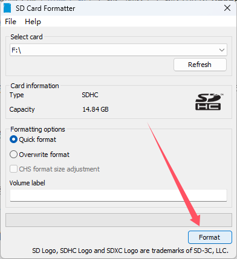
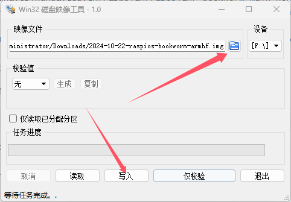
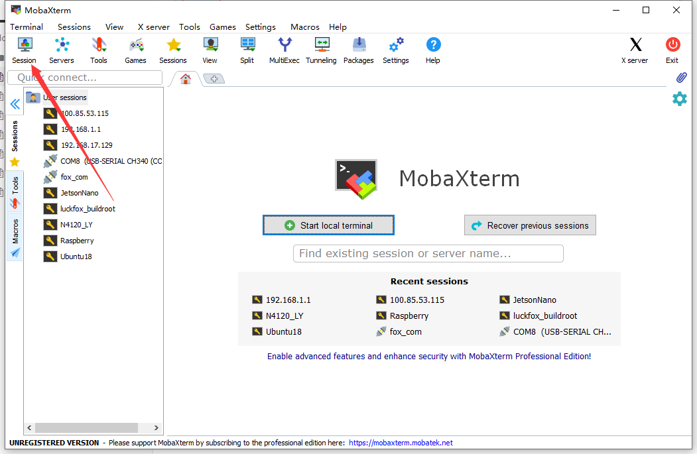
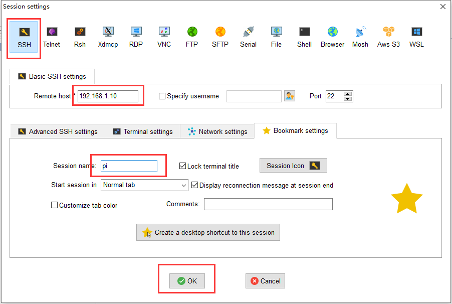
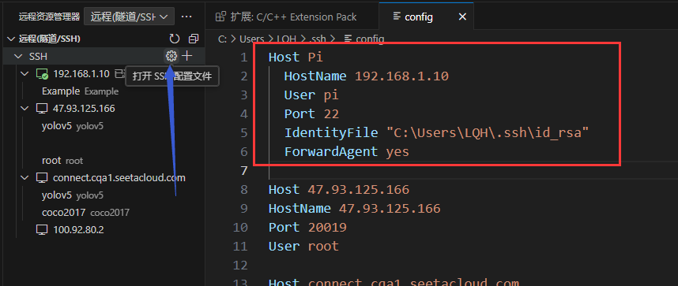

## 说明

该系列笔记使用的是树莓派3B+，将使用树莓派进行接下来智能家居项目的编程。这篇笔记将记录如何烧写树莓派固件以及搭建树莓派开发环境。

## 相关软件下载

1、SDCardFormatter

这是格式化SD卡用的软件，在我开源的github仓库上面有，也可以自己去下，或者自己有可以格式化的工具也可以使用。

2、win32diskimager

这是写入镜像的软件，也在我开源的github仓库上面有。

3、树莓派固件镜像

需要的树莓派镜像资源的可以去树莓派实验室[资源下载](https://shumeipai.nxez.com/download)里下载。我这里下载使用的是**Raspberry Pi OS 32 位 桌面版**

https://shumeipai.nxez.com/download

下载之后**解压**即可。一定记得解压，不然无法使用。

4、MobaXterm

我们使用这个远程连接我们的树莓派，以及使用它将文件在树莓派和PC间移动，他的下载可以去[官网](https://mobaxterm.mobatek.net/download.html)。也在我开源的github仓库上面有。

5、Vscode

我们使用这个软件来编写我们的代码。[官网](https://code.visualstudio.com/)下载即可。

## 系统烧写

使用SDCardFormatter先将SD卡格式化。



然后使用win32diskimager选择我们刚刚解压好的镜像。



写入完成后，电脑可能会叫你格式化，不管那个，取消后退出读卡器即可。

## 开机配置

将SD卡插入树莓派，我这里讲述的是**有屏幕情况下的操作**，没有屏幕可以先查看其他教程使得能够正常开机再看我之后的讲解。

等其开机后，会有开机相关配置，弹出来以下处理的弹框。

1、先是一个欢迎窗口，直接点击NEXT

2、然后是Set Country，这个时候国家选择China即可，另外两个应该会自动调整，如果没自动，就手动调整Chinese语言、Timezone选择你的地方。language和keyboard可以不管，也可以自己看情况。

3、然后是Create User，这里是创建用户和设置密码，自己设置即可，记得就行。

4、然后是Select WiFi Network，选择一个网络进行连接，这一步可以跳过，也可以连接。下一步就是输入密码连接了。

5、然后是Choose Browser，选择默认浏览器，默认即可。

6、然后是Update Software，这个直接跳过，没有换源的情况下，这个很卡。

7、最后就是Restart。

注意：可能经典版会有部分不一样，但是大部分都相同，能正常启动即可。

开机后，按住Ctrl+Alt+T，打开终端。输入指令

```bash
ifconfig
```

查看连接的wifi名为wlan0的IP地址，我这里是192.168.1.10，每个人肯定不一样，记住自己的。

在终端栏中，输入

```
sudo raspi-config
```

这会打开一个图形化界面。界面中使用方向键控制光标，Enter键进行选择。

打开SSH： Interfacing Options -> SSH -> Yes

退出图形化界面：（左右方向键选择）Finish

这时，打开了SSH服务，然后我们就可以使用远程连接。

## 远程连接

在配置好SSH后，就可以使用MobaXterm等远程SSH登录树莓派了。





输入之前定义的用户名和密码就可以了。

## 换源

由于树莓派本身的服务器在国外，所以我们换成国内源会更快。

```bash
sudo nano /etc/apt/sources.list
```

将里面原来的源注释，将下面的源复制进去

```
deb https://mirrors.tuna.tsinghua.edu.cn/raspbian/raspbian/ bookworm main non-free contrib rpi
# deb-src https://mirrors.tuna.tsinghua.edu.cn/raspbian/raspbian/ bookworm main non-free contrib rpi

# deb [arch=arm64] https://mirrors.tuna.tsinghua.edu.cn/raspbian/multiarch/ bookworm main
```

修改完成后，看下面的注释`Ctrl+O`保存，`Ctrl+X`退出。

退出后，更新软件，就会更新成清华源

```bash
sudo apt-get update
```

部分配置会说不支持arm64体系结构，如果源更新失败，参考清华源官方的设置，如下

[raspbian | 镜像站使用帮助 | 清华大学开源软件镜像站 | Tsinghua Open Source Mirror](https://mirrors.tuna.tsinghua.edu.cn/help/raspbian/)

## vscode配置

我们后面的代码编写将在PC端上使用VScode远程树莓派实现，下面介绍怎么实现远程登录

### 安装

安装插件，**插件名称**就是 Remote - SSH

### 配置SSH密钥

将本机添加到远程服务器连接白名单，让服务器知道是已认证的电脑在连接

在PC端CMD使用如下命令，生成 SSH 公钥文件。

```bash
ssh-keygen
```

会让输入保存路径，一直回车默认即可。我的生成之后在`C:\Users\LQH\.ssh`路径下

找到公钥文件 `id_rsa.pub` ，使用MobaXterm上传到远程服务器的 `.ssh` 文件夹中。.ssh的路径类似这样：`/home/lqh/.ssh`。`.ssh` 文件夹没有怎么办？新建一个文件夹，命名为 `.ssh` 即可。同时要确认远程服务器是否支持 SSH ，如果此时正是通过 SSH 方式连接的，那肯定是支持了。

最后生成 `authorized_keys` 文件。这样后续在使用 Remote 插件时，不需要密码，就可以直接登录到服务器。

进入树莓派`.ssh` 目录，使用如下命令，生成 `authorized_keys` 文件。`id_rsa.pub`是前面说的在windows下生成的

```bash
cd ~/.ssh
cat id_rsa.pub > authorized_keys
```

### 添加配置文件

目的：**配置 VSCode 连接远程服务器的一些基本信息。**

1、点击左侧的 “远程资源管理器” 图标，点击右上角的小齿轮（设置）



2、在弹出来的窗口中，选择第一个 config 文件打开，填写对应信息，例如

```bash
Host <远程主机名称>
    HostName <远程主机IP>
    User <用户名>
    Port <ssh端口，默认22>
    IdentityFile <本机SSH私钥路径>
    ForwardAgent yes <VSCode 自己添加的，不用管>

Host Pi
    HostName 192.168.1.10
    User pi
    Port 22
    IdentityFile "C:\Users\LQH\.ssh\id_rsa"
    ForwardAgent yes
```

## 结尾

至此，开机基本配置结束，下面将进行树莓派硬件操作控制的学习。