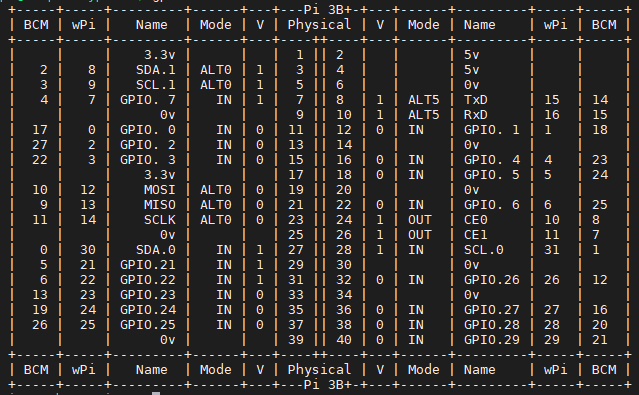

## 说明

该笔记实现的功能，检测按键的输入，控制led灯的输出。

这个场景可以模拟一些智能家居设备中的开关等，可以是远程的，或者一些什么设置选项的开关。

我设计的智能家居扩展板一共有3个普通的用GPIO口控制的按键，分别是BCM编号，26、21和20。



## 代码

1、`int digitalRead (int pin)`

pin：读取的引脚

返回：引脚上的电平，可以是LOW HIGH 之一

2、`void pullUpDnControl   (int pin, int pud) `

pin：配置的引脚

pud：设置上下拉模式 PUD_OFF：无     PUD_DOWN：下拉     PUD_UP：上拉


c文件名我命名为main.c，实现的功能就是按键端口检测为0，就设置LED端口电平为0，反之为1。

```c
#include <wiringPi.h>
#include <stdio.h>

#define LED 17
#define KEY 26

int main(void)
{
    int key_value = 0;

    if(wiringPiSetupGpio() < 0) //当使用这个函数初始化树莓派引脚时，程序使用的是BCM引脚编号表。
        return 1;
    
    pinMode(KEY,INPUT);  //设置引脚为输入模式
    pullUpDnControl(KEY,PUD_UP);//设置引脚为上拉模式
    pinMode(LED,OUTPUT); //设置引脚为输出模式
    
    while (1)
    {
        key_value = digitalRead(KEY); //读取引脚电平
        if(key_value == 0)
        {
            digitalWrite(LED,0);      //设置引脚电平为0
        }else
        { 
            digitalWrite(LED,1);      //设置引脚电平为1
        }  
    }
}
```

然后编译这段代码

```bash
cc -Wall -o main main.c -lwiringPi
```

 -Wall 表示编译时显示所有警告，-lwiringPi 表示编译时动态加载 wiringPi 库

编译完成后调用生成的main文件

```bash
sudo ./main
```

然后就可以看到按键按下，灯就点亮，按键抬起，灯就熄灭。

想要停止这个程序，`Ctrl+c`即可。

## 分文件编写

想要将key的驱动部分隔离出来，建立bsp_key.c和bsp_key.h文件。具体的写法参考开源代码。

分文件后，多文件的编译如下

```bash
cc -Wall -o main main.c bsp_led.c bsp_key.c -lwiringPi
```

把bsp_key.c文件也加入进去。
