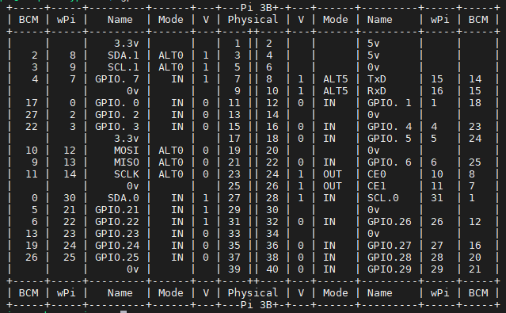
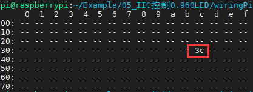

## 实验说明

我们这里会使用IIC去驱动一个0.96的OLED，首先需要打开IIC

```
sudo raspi-config
Interfacing Options------>I2C------>Yes------->OK------->finsh
```

然后将屏幕接到树莓派上，接SDA.1和SCL.1的脚



然后使用以下指令查看

```bash
sudo i2cdetect -y -a 1
```

如果出现以下



就算成功了。

## 代码编写

### wiringPi

主要说一下怎么初始化和发送数据，具体的实现，参考github的开源链接。

1、函数设置要控制的节点对象，将返回设备节点。

```c
int wiringPiI2CSetup (int devId) ;
```

2、读取设备节点值

```c
int wiringPiI2CRead (int fd) ;
```

3、给设备节点值写值

```c
int wiringPiI2CWrite (int fd, int data) ;
```

4、给设备节点的某一个寄存器写值

```c
//写1个字节
int wiringPiI2CWriteReg8 (int fd, int reg, int data) ;
//写2个字节
int wiringPiI2CWriteReg16 (int fd, int reg, int data) ;
```

5、读取设备节点某一个寄存器的值

```c
//读取一个字节数据
int wiringPiI2CReadReg8 (int fd, int reg) ;
//读取两个字节数据
int wiringPiI2CReadReg16 (int fd, int reg) ;
```

下面是一个初始化IIC的代码，然后使用的OLED.c就是中景元开源的代码，将IIC部分做了修改。

这是main.c的代码

```c
#include <wiringPi.h>
#include <stdio.h>
#include <wiringPiI2C.h>
#include "oled.h"

int fd;

void oled_write_one_byte(uint8_t dat,uint8_t mode)
{
    wiringPiI2CWriteReg8(fd,mode,dat);
}

int main(void)
{ 
    if(wiringPiSetup() < 0) //当使用这个函数初始化树莓派引脚时，程序使用的是wiringPi 引脚编号表。
        return 1;
    fd = wiringPiI2CSetup (SlaveAddress);
    if(fd < 0)
    {
        printf("IIC初始化失败\r\n");
        return fd;
    }

    OLED_Init();
    OLED_Clear();
    OLED_ShowString(0,0,(char*)"HELLO2",16,1);
    OLED_Refresh();//更新显示
 
    return 0;
}
```

这是oled.c主要修改的部分

```c
extern void oled_write_one_byte(uint8_t dat,uint8_t mode);

void OLED_WR_Byte(uint8_t dat,uint8_t mode)
{
    oled_write_one_byte(dat,mode);
}

```

然后编译这段代码

```bash
cc -Wall -o main main.c oled.c -lwiringPi
```

 -Wall 表示编译时显示所有警告，-lwiringPi 表示编译时动态加载 wiringPi 库

编译完成后调用生成的main文件

```bash
sudo ./main
```

想要停止这个程序，`Ctrl+c`即可。

### bcm2835

主要说一下怎么初始化和发送数据，具体的实现，参考开源链接。

1、开始I2C操作

```c
int bcm2835_i2c_begin(void);
```

2、设置IIC从机地址

```c
void bcm2835_i2c_setSlaveAddress(uint8_t addr);
```

3、设置工作频率

```c
void bcm2835_i2c_set_baudrate(uint32_t baudrate);
```

4、给设备节点写值，要写寄存器的话，就把第一个数设置成为寄存器，后面的数就是要发的数

```c
uint8_t bcm2835_i2c_write(const char * buf, uint32_t len);
```

5、从设备节点读值

```c
uint8_t bcm2835_i2c_read(char* buf, uint32_t len);
```

5、结束I2C操作

```c
void bcm2835_i2c_end(void);
```

注意，下面是一个实际例子，oled部分的处理和wiringPi一样这里就不写了。

```c
#include <stdio.h>
#include <stdlib.h>
#include <string.h>
#include <stdint.h>
#include <bcm2835.h>
#include "oled.h"

#define I2C_ADDR_OLED 0x3C
 
void oled_write_one_byte(uint8_t dat,uint8_t mode)
{
    char WriteBuf[2] = {mode,dat};
    bcm2835_i2c_write(WriteBuf,2);
}

int main(int argc, char **argv)
{
	if (!bcm2835_init())  
		return 1;  
 
    bcm2835_i2c_begin();
    bcm2835_i2c_setSlaveAddress(I2C_ADDR_OLED);
    bcm2835_i2c_set_baudrate(100000); /* 100 KHz */

    OLED_Init();
    OLED_Clear();
    OLED_ShowString(0,0,(char*)"HELLO3",16,1);
    OLED_Refresh();//更新显示
 
    bcm2835_i2c_end();   
    bcm2835_close();
 
    return 0;
}
```

然后编译这段代码

```bash
gcc -Wall main.c oled.c -o main -lbcm2835
```

 -Wall 表示编译时显示所有警告，-lbcm2835 表示编译时动态加载bcm2835 库

编译完成后调用生成的main文件

```bash
sudo ./main
```

想要停止这个程序，`Ctrl+c`即可。

### RPi.GPIO

python控制iic的话，是有专门的别人写好的库。有两个库可以选择luma和Adafruit，但是我们下面的使用只使用luma。

```bash
pip install luma.oled
```

我们使用python安装的时候，应该会报错error: externally-managed-environment，网上有几种方法解决，可以参考[这篇博文](https://blog.csdn.net/2202_75762088/article/details/134625775)，我使用的是他说的创建venv的方式。

```bash
python -m venv ~/myenv        #创建虚拟环境，myenv就是环境名
source ~/myenv/bin/activate   #使能我们创建的虚拟环境
pip install luma.oled         #再次Pip安装
```

其他env操作

```
deactivate #退出环境
```

直接给代码了

```python
#!/usr/bin/python3
# -*- coding: utf-8 -*-
from luma.core.interface.serial import i2c, spi
from luma.core.render import canvas
from luma.oled.device import ssd1306, ssd1325, ssd1331, sh1106
from time import sleep
"""
OLED luma 驱动库测试程序
功能：显示 hello world 和矩形外框持续10秒
"""
__version__ = 1.0
# 初始化端口
serial = i2c(port=1, address=0x3C)
# 初始化设备，这里改ssd1306, ssd1325, ssd1331, sh1106
device = ssd1306(serial)
print("当前版本：", __version__)
# 调用显示函数
with canvas(device) as draw:
    draw.rectangle(device.bounding_box, outline="white", fill="black")
    draw.text((30, 20), "Hello World", fill="white")
# 延时显示10s
sleep(10)
```

更多资料可查看https://github.com/rm-hull/luma.examples