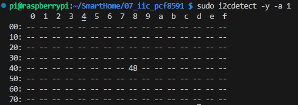

## 实验说明

我们这里会使用IIC去驱动一个PCF8591，这是一个AD/DA转换器，通过IIC获取和设置输入输出。我们把它的输出接了一个LED灯，我们就可以通过控制DA的输出来控制这个LED灯的亮，模拟智能家居的台灯，我们在AD输入接了一个光敏电阻电路，用来模拟检测阳光大小，处理一些逻辑判断，还有3个AD转换口，我引了出来，可以根据自己的需要添加模块。

首先需要打开IIC

```bash
sudo raspi-config
Interfacing Options------>I2C------>Yes------->OK------->finsh
```


然后使用以下指令查看

```bash
sudo i2cdetect -y -a 1
```

如果出现以下



就算成功了。

## 代码编写

### wiringPi

主要说一下怎么初始化和发送数据，具体的实现，参考github的开源链接。

1、函数设置要控制的节点对象，将返回设备节点。

```c
int wiringPiI2CSetup (int devId) ;
```

2、读取设备节点值

```c
int wiringPiI2CRead (int fd) ;
```

3、给设备节点值写值

```c
int wiringPiI2CWrite (int fd, int data) ;
```

4、给设备节点的某一个寄存器写值

```c
//写1个字节
int wiringPiI2CWriteReg8 (int fd, int reg, int data) ;
//写2个字节
int wiringPiI2CWriteReg16 (int fd, int reg, int data) ;
```

5、读取设备节点某一个寄存器的值

```c
//读取一个字节数据
int wiringPiI2CReadReg8 (int fd, int reg) ;
//读取两个字节数据
int wiringPiI2CReadReg16 (int fd, int reg) ;
```

下面是一个初始化pcf和使用pcf的代码。

这是pcf8591.c的代码

```c
#include "pcf8591.h"

#include "wiringPi.h"
#include "wiringPiI2C.h"
#include <unistd.h>

#define pcfAddress 0x48

static int pcf8591_fd = 0;

int pcf8591Setup ()
{
    if ((pcf8591_fd = wiringPiI2CSetup (pcfAddress)) < 0)
        return FALSE ;
    return TRUE ;
}

void pcfAnalogWrite (int value)
{
    if(pcf8591_fd <= 0)
        return;
    wiringPiI2CWriteReg8(pcf8591_fd,0x40,value);
}

uint8_t pcfAnalogRead (int pinReg)
{
  uint8_t adcx ; 

  adcx = wiringPiI2CReadReg8(pcf8591_fd, 0x40|pinReg);

  return adcx ;
}
```

然后main里我们写一点读取和设置。写的逻辑是按键1按下就DA值加价，按键2按下DA值就减减，按键3按下就读取AD0的值，并打印。

```c
#include <wiringPi.h>
#include <stdio.h>

#include "bsp_led.h"
#include "bsp_key.h"
#include "bsp_beep.h"
#include "pcf8591.h"

int main(void)
{
    int key_value  = 0;
    int dac_led_value = 0;
    uint8_t night_adc     = 0;
    if(wiringPiSetupGpio() < 0) //当使用这个函数初始化树莓派引脚时，程序使用的是wiringPi 引脚编号表。
        return 1;
    
    led_init();
    key_init();
    if(pcf8591Setup()==FALSE)
        printf("pcf初始化失败\r\n");
    else
        printf("pcf初始化成功\r\n");

    while (1)
    {
        key_value = KeyScan(SINGLE_SCAN); //读取引脚电平
        if(key_value == 1)
        {
            dac_led_value +=50;
            if(dac_led_value>250) dac_led_value=250;
            pcfAnalogWrite(dac_led_value);     
        }else if(key_value == 2)
        { 
            dac_led_value -=50;
            if(dac_led_value<0) dac_led_value=0;
            pcfAnalogWrite(dac_led_value); 
        }else if(key_value == 3)  
        {
            night_adc = pcfAnalogRead(0);
            printf("%u\r\n",night_adc);
        }
        delay(5);
    }
}
```

编写完成后使用之前的Makefile文件，make即可。

```bash
make
sudo ./main
```

想要停止这个程序，`Ctrl+c`即可。

