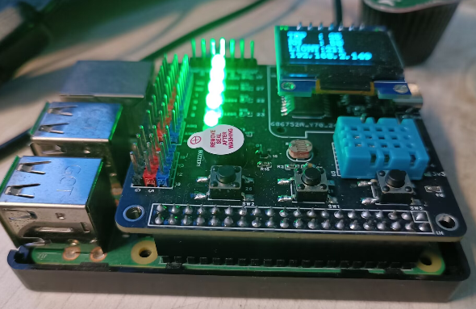

# RaspberryPiSmartHome
树莓派智能家居项目，学习树莓派的wiringpi用C语言开发，并且组合成一个智能家居项目。主要是设计了一块扩展板方便学习并且记录相关学习笔记。

项目相关代码资料开源：https://github.com/snqx-lqh/RaspberryPiSmartHome

## 实物展示

扩展板包含的部分有：

LED灯、蜂鸣器、按键、OLED(SPI)、PCF8591(IIC)、DHT11以及部分扩展接口。

## 笔记资料

笔记资料主要是使用学习过程中做的部分记录，可能不一定正确，内容也不一定完整，参考了许多网上的资料，仅供参考。

文档存放在开源文件夹`02_Firmware\00_FirmwareDoc`

文档代码就在`02_Firmware`文件夹下

目前包含的内容如下：

01_树莓派的系统烧录以及初次开机

02_LED输出控制

03_按键输入检测

04_蜂鸣器输出控制

05_Makefile简单实验

06_PWM输出和舵机控制

07_IIC和PCF8591实验

08_SPI和OLED实验

09_UART实验

10_MQTT实验

11_DHT11温湿度传感器

12_多线程编程

13_智能家居分析

14_APP体验
